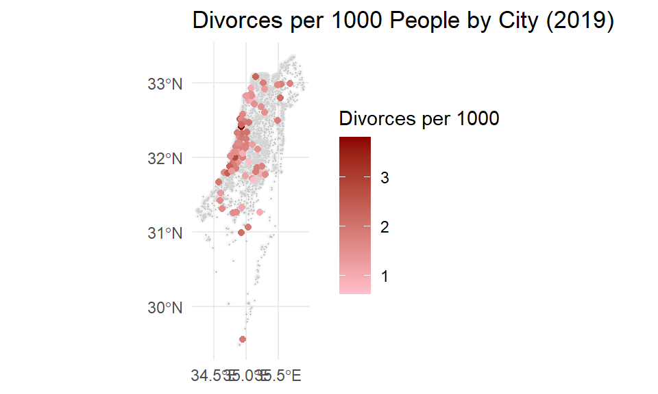
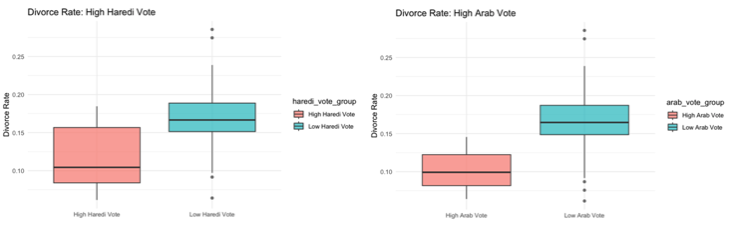
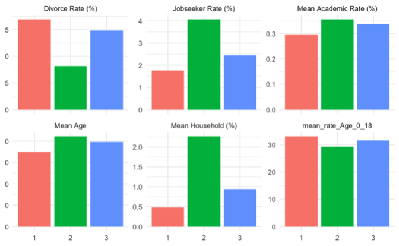

# 💔 Divorce Rates in Israel: Demographic Analysis with R
This project demonstrates a complete data analysis pipeline for understanding divorce patterns across Israeli cities using advanced R statistical methods.

---

## 📌 Overview
We collect, analyze, and visualize Israeli municipal data using:
- **R & RStudio** (statistical analysis & clustering)
- **K-means Clustering** (city segmentation by demographics)
- **ggplot2** (advanced data visualization)
- **tidyverse** (data manipulation & cleaning)
- **Multiple Gov.il datasets** (official government sources)

---

## 🗺️ Analysis Architecture


---

## 🔬 Statistical Analysis with R
Data from multiple government sources (demographics, voting, population) is merged and analyzed using R's statistical capabilities and k-means clustering.

📷 **Key City Comparison:**  


📷 **Cultural Voting Patterns:**  


📜 **Main Analysis Script:**  
→ [Final_project.Rmd](src/Final_project.Rmd)

📜 **Complete Report:**  
→ [Final_project.docx](docs/Final_project.docx)

---

## 🧠 R Analysis Methods
Key statistical techniques used in the analysis (located in `Final_project.Rmd`):
- `k-means clustering` – Segments cities into 3 demographic groups
- `correlation analysis` – Identifies relationships between cultural and divorce variables  
- `boxplot comparisons` – Compares divorce rates across cultural voting categories
- `demographic profiling` – Characterizes each city cluster

---

## 📊 Key Findings
Our R analysis reveals clear patterns — cultural identity dominates demographics, religious communities show stability, age correlates with lower divorce rates.



### 🎯 Statistical Results
| Cluster Type | Divorce Rate | Avg Age | Key Pattern |
|--------------|--------------|---------|-------------|
| **Jewish-Majority** | 1.69% | 35 years | Young, secular cities |
| **Arab-Majority** | 0.82% | 42.2 years | Older, traditional communities |
| **Mixed Cities** | 1.48% | 39.7 years | Moderate across indicators |

---

## 🔁 Analysis Flow Summary
1. Load raw data files from Israeli Government Portal (gov.il)
2. Clean and merge datasets using `tidyverse`
3. Perform exploratory analysis on 5 representative cities
4. Create cultural proxies from voting data
5. Run k-means clustering on demographic composition
6. Generate statistical summaries and visualizations
7. Validate results and interpret patterns

---

## 🔧 Tools & Packages Used
| Tool/Package | Purpose |
|--------------|---------|
| R | Statistical computing environment |
| RStudio | IDE for analysis and reporting |
| tidyverse | Data manipulation ecosystem |
| ggplot2 | Advanced data visualization |
| cluster | K-means and clustering algorithms |
| readxl | Excel file processing |
| knitr | Report generation from R Markdown |

---

## 📊 Dataset Overview
| File | Records | Source | Purpose |
|------|---------|--------|---------|
| `Demographic.xlsx` | Municipal-level | gov.il | Job seeker demographics & education |
| `Population.xlsx` | 255 cities | gov.il | Population breakdown by ethnicity |
| `Divorces.csv` | Annual data | gov.il | Divorce counts per municipality |
| `Election.csv` | 2019 results | gov.il | Political voting patterns |
| `Age.csv` | Age groups | gov.il | Population age distributions |
| `Population_TJBN.csv` | 5 key cities | Manual | Tel Aviv, Jerusalem, Bnei Brak data |

---

## 🚀 Quick Start

### Prerequisites
```r
# Install required packages
install.packages(c("tidyverse", "readxl", "ggplot2", "cluster", "clusterCrit", "caret"))
```

### Run Analysis
```r
# Open main analysis file
file.edit("Final_project.Rmd")

# Generate complete report
rmarkdown::render("Final_project.Rmd")
```

---

## 🎓 Academic Context
**Author**: David Kalimi  
**Course**: Data Analysis in R  
**Year**: 2024  
**Method**: K-means clustering + Statistical modeling

### 📚 Key References
1. **Lawdin** - Divorce Trends in Israel
2. **OECD** - Marriage and Divorce Statistics (2023)
3. **Vermeulen et al.** - Religion and Divorce Research (2023)

---

